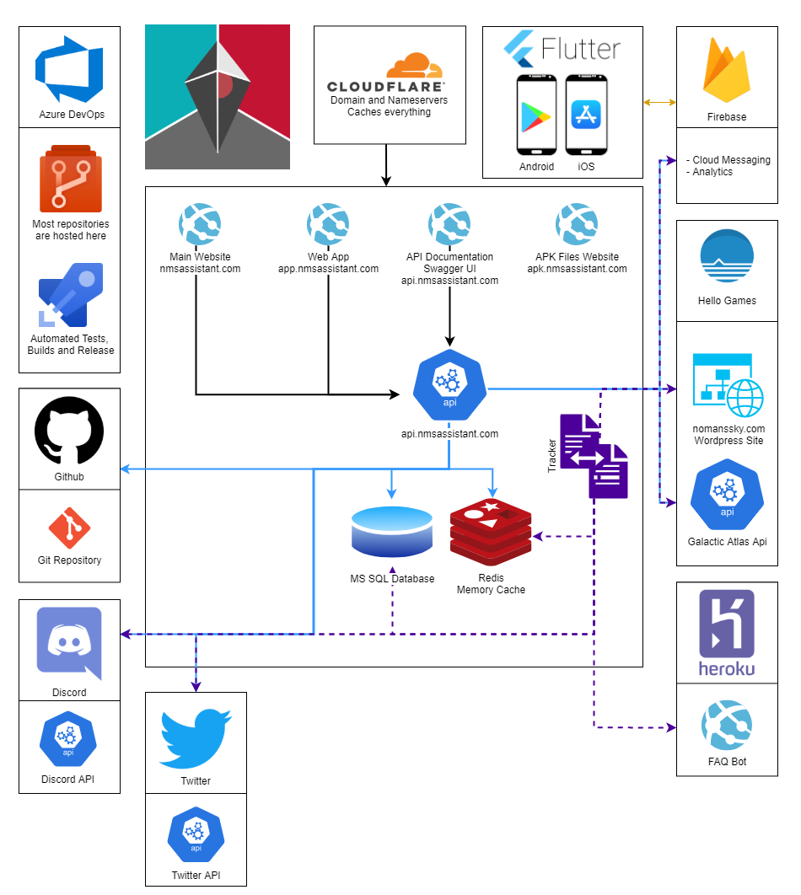

# Architecture

Here is a visual representation of the ecosystem that the Assistant for No Man's Sky apps are a part of.

> Some of the information in the image below might be out of date.

## Initial plan

Originally the app was designed to have everything be offline. Building, hosting and maintaining a server is costly especially in situations where it is not needed. As NMS was not updating frequently, there seemed to be no need. Over the last few years of updates and features added to the game such as lore heavy Weekend Missions, Expeditions etc. The need for a backend server increased and the architecture of the Assistant for No Man's Sky apps became more complex.

## WebApi

The Assistant for No Man's Sky API can be found here: [api.nmsassistant.com](https://api.nmsassistant.com). Navigating to the API will load Swagger documentation, which lists the available endpoints and what the structure is of the data returned.

You can select the level of detail of the documentation in the top right of the page

