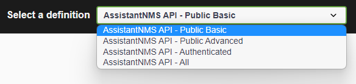
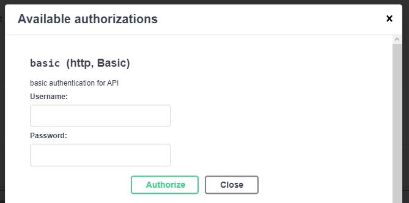
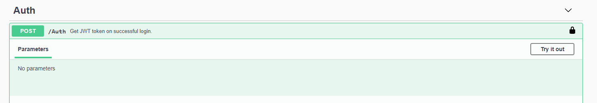

# Web Api

The Assistant for No Man's Sky API can be found here: [api.nmsassistant.com](https://api.nmsassistant.com).  Navigating to the API will load the Swagger documentation, which lists the available endpoints and what the structure is of the data returned.

---

### Definition selection
You can select the level of detail of the documentation in the top right of the page. The **Authenticated** definition lists the endpoints that require you to be authenticated with the API, view the section below on how to authenticate with the API. 

---

### Authentication

First step is to get an account! There is no way to register. Please reach out to `Khaoz-Topsy` on our [Discord][discord].

On the [Swagger docs site](https://api.nmsassistant.com) click on the **Authorize** button and fill your details into the **basic** section and click the **Authorize** as shown in the image below.

Make the `Auth` request (Make sure that you are on the All or Authenticated definition)

Copy the token from the response, past it into the **Authorize** popup and logout of the **basic** authentication. Now you are set to make any API calls.

_Note: You will need the correct permissions set on your account to be able to affect the AssistantNMS API data 😋_

[discord]: https://assistantapps.com/discord?ref=assistantAppsDocs