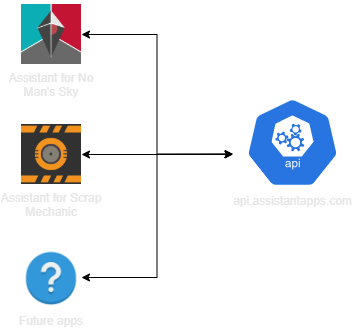
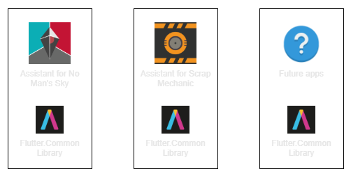

# Overview

> The services that are shared between the apps are constantly being worked on, updated and changed. The below information might be out of date. Feel free to make a pull request with updated information! _This really helps us out!_

### Shared Services
The Apps that belong to AssistantApps, have the ability to send and request data to the [AssistantApps Api](assistantAppsApi). Checkout the [Api documentation](assistantAppsApi) to see how to integrate the [AssistantApps](assistantApps) services into your websites or apps.

### Shared Library
The AssistantApps Apps also make use of the [AssistantApps Flutter Library](assistantAppsCommonLibrary), which contains a lot of common functionality. You can find documentation on how to use a few of the functions and widgets in the library on this website.

<!-- Links used in the page -->
[assistantApps]: https://assistantapps.com?ref=assistantAppsDocs
[assistantAppsApi]: https://api.assistantapps.com?ref=assistantAppsDocs
[assistantAppsCommonLibrary]: https://github.com/AssistantApps/Flutter.Common?ref=assistantAppsDocs